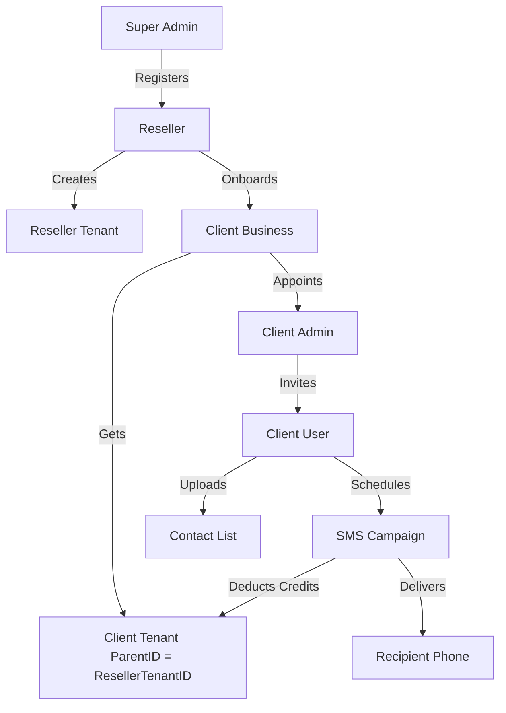
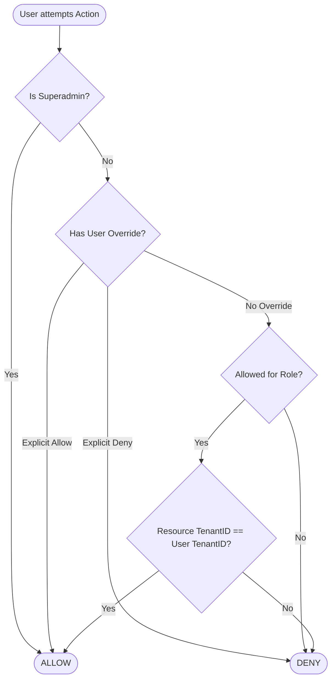
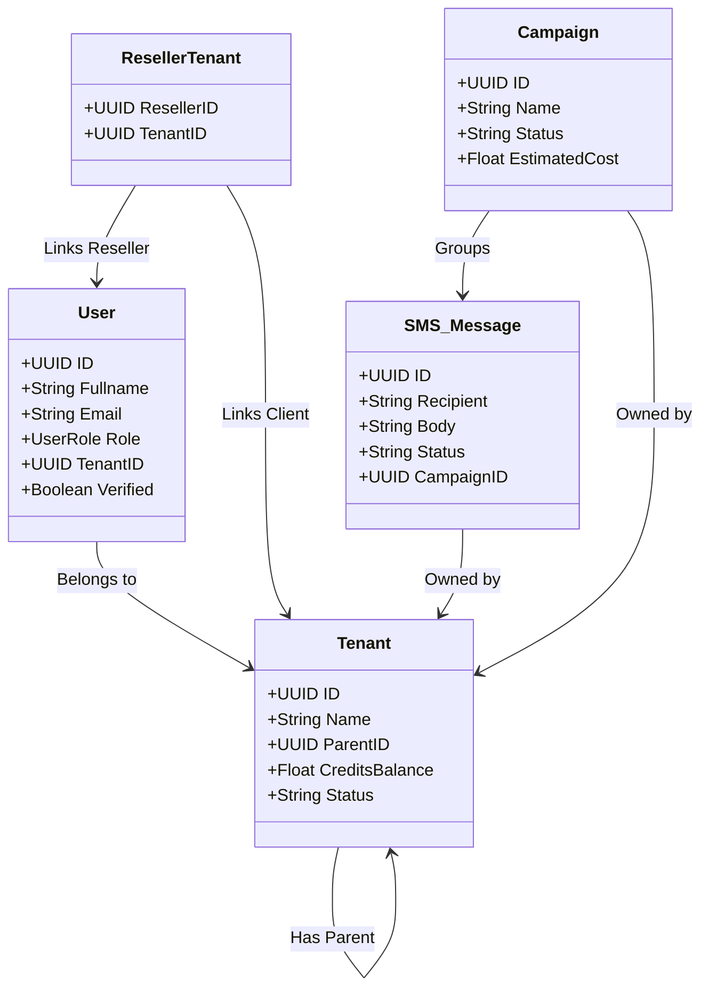

# Hajiz.ai | Master System Specification

This document provides an exhaustive, top-to-bottom breakdown of the Hajiz.ai B2B SMS platform. It defines every role, entity, relationship, and workflow in the system, serving as both a business blueprint and a technical reference.

---

## 1. Project Mission & Scope
Hajiz.ai is a multi-tenant B2B SMS Communications Platform designed for high-volume message delivery, campaign orchestration, and hierarchical reseller management. 

**Core Value Proposition:**
- **Isolation:** Each business (Tenant) resides in a private silo enforced by PostgreSQL RLS.
- **Hierarchy:** Partners (Resellers) can manage vast portfolios of clients.
- **Precision:** Granular RBAC ensures users only see what they are authorized to see.
- **Resilience:** Built on a Go-Fiber backend with a **struct-based Dependency Injection (DI)** pattern, ensuring testability and strict separation of concerns between domain repositories and presentation handlers.
- **Identity:** UUID-based identity model for all system entities.

---

## 2. Role Definitions & Power Dynamics

### 👑 Super Admin (The All-Seeing Administrator)
The highest authority in the system. They operate outside the "Tenant Jails."
- **Capabilities:**
    - **Global Management:** Onboard new Resellers and create Reseller Tenants.
    - **System Configuration:** Manage global SMS providers, pricing plans, and platform settings.
    - **Global Oversight:** View and manage every user, tenant, and campaign across the entire system.
    - **RBAC Authority:** Define the master set of permissions and roles that others can use.
- **Scoping:** `TenantID = NULL`. They have cross-tenant access.

### 💼 Reseller (The Master Partner / Seller)
A middle-layer partner who manages a portfolio of clients.
- **Capabilities:**
    - **Client Onboarding:** Create sub-tenants for their clients.
    - **Credit Management:** Allocate credit balances to their clients from their own master pool.
    - **Portfolio Dashboard:** Monitor the activity and status of all their assigned tenants.
    - **Support:** Act as the first point of contact for their clients.
- **Scoping:** Connected to sub-tenants via the `ParentID` and the [ResellerTenant](file:///mnt/sda5/Projects/hijaziai/internal/domain/rbac.go#90-101) mapping table.

### 🏢 Client Admin (The Business Owner / Manager)
The head of a specific tenant (e.g., a Marketing Agency or a Retailer).
- **Capabilities:**
    - **Team Management:** Add and manage `Client Users` within their own organization.
    - **API Keys:** Manage unique API keys for integrating with external software.
    - **Billing & Credits:** Monitor the organization's credit usage and campaign costs.
- **Scoping:** Strictly locked to a single `TenantID`. Cannot see other tenants or the Reseller's internal data.

### 👤 Client User (The Marketing Hero / Operator)
The operational staff who execute the actual work.
- **Capabilities:**
    - **SMS Messaging:** Send single messages or large-scale campaigns.
    - **Contact Management:** Import, export, and organize contact lists.
    - **Reporting:** View the performance of their own campaigns.
- **Scoping:** Locked to a single `TenantID`. Access to specific resources (like "Export") can be disabled via Admin Overrides.

---

## 3. Data Ecosystem (The "Bones" of the System)

### 🏬 Tenants (Organizations)
The fundamental unit of isolation.
- **ID (UUID):** Unique identifier.
- **ParentID (UUID):** Links a Client to a Reseller.
- **CreditsBalance:** Total credits available for sending messages.
- **Status:** Active, Suspended, or Inactive.

### 👤 Users (Identity)
- **Role:** One of the 4 roles defined above.
- **TenantID:** Links the user to their organization.
- **Verified:** Status of email/OTP verification.

### 📱 SMS & Campaigns (Operation)
- **Campaign:** A high-level orchestration of a marketing effort (e.g., "Ramadan Sale").
- **SMS Message:** Individual delivery record with status (Queued, Sent, Delivered, Failed).
- **Sender ID:** The alphanumeric name (e.g., "HAJIZ") that appears on the recipient's phone.

---

## 4. Detailed Flowcharts

### 🔄 The Onboarding Journey (Success Flow)

### 🔐 Permission Resolution logic

---

## 5. Detailed Data Schema (Simplified for Stakeholders)

---

## 6. How it Works: Step-by-Step

### Single SMS Sending
1. **Request:** A user sends a message via Web or API.
2. **Scoping:** System checks if the User has permission to send and enough credits in their `TenantID`.
3. **Drafting:** A record is created in `SMSMessages` with status `queued`.
4. **provider Call:** The backend selects the best SMS provider and sends the data.
5. **Update:** Once the provider responds, the status updates to `sent` or `failed`.
6. **Billing:** The `CreditsBalance` in the [Tenant](file:///mnt/sda5/Projects/hijaziai/internal/domain/tenant.go#10-23) is updated.

### Campaign Management
1. **Creation:** User uploads a CSV of 10,000 contacts.
2. **Scheduling:** User sets the campaign to start at 9:00 AM.
3. **Background Worker:** At 9:00 AM, the system wakes up and begins iterating through the contacts via the `CampaignService`.
4. **Throttling:** Messages are sent in batches to avoid overwhelming the provider.
5. **Real-time Monitoring:** The [Campaign](file:///mnt/sda5/Projects/hijaziai/internal/domain/campaign.go#10-35) record tracks `DeliveredCount` and `FailedCount` in real-time.

---

## 7. Architectural Resilience & Standards

Hajiz.ai adheres to a **Clean Architecture (DDD-Lite)** implementation:

1. **Presentation Layer (`internal/web`, `internal/api`)**:
   - Every handler is a struct that receives its dependencies (Repositories, Services) via its constructor (`New<Handler>`).
   - No handler instantiates its own database connection or repository locally.
   - All handlers depend on the `RBACService` for permission checks.

2. **Domain Layer (`internal/domain`)**:
   - Contains pure business entities and constants.
   - Defines the universal language of the system (Tenants, Users, SMS, Campaigns).

3. **Data Layer (`internal/repository`)**:
   - Enforces data isolation and RLS scoping.
   - Provides a standardized interface for data mutation.

4. **Bootstrapping Layer (`cmd/server/main.go`, `internal/api/routes`)**:
   - The centralized location where the application is assembled.
   - Repositories are instantiated once and injected into the appropriate services and handlers.
